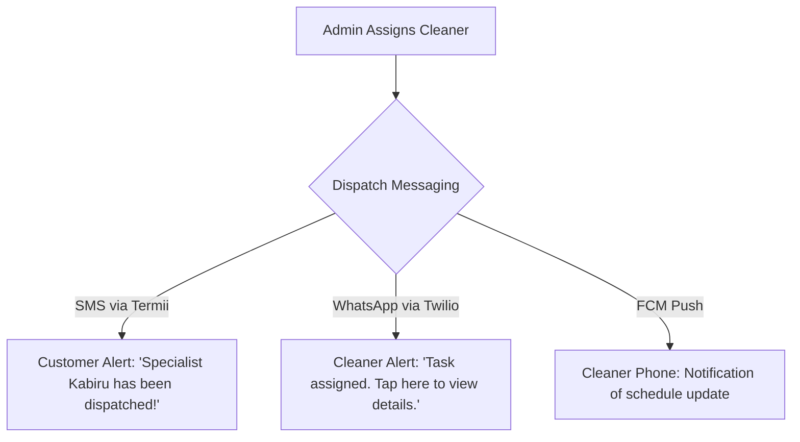

# CleanNaija | Backend Product Requirements Document (PRD)

Welcome to the CleanNaija Backend Requirements Document. This document serves as the single source of truth for the backend team to build a fully functional, secure, and performant REST API that supports the CleanNaija professional cleaning platform.

All mock data, state mechanisms, and pages from the React frontend have been converted into production-ready backend specifications.

---

## 1. Project Overview & Business Model

**CleanNaija** is Nigeria's premier centralized professional cleaning service provider. The platform connects customers directly to CleanNaija's elite, vetted cleaning teams.

### ⚠️ Critical Concept Alignment:
> [!IMPORTANT]
> **This is NOT a Customer/Cleaner Marketplace.**
> - Customers do not browse, bid on, or hire independent cleaners. They request quotes and schedule cleanings directly with **CleanNaija** as a company.
> - CleanNaija is the service provider itself, managing pricing, logistics, security guarantees, and execution.
> - **We hire our own cleaners**: Cleaners are employees or contracted partners who go through background screening (including NIN verification) and training.
> - **Centralized Dispatch**: Hired staff cleaners are directly assigned to bookings by CleanNaija administrators. Hired staff log in to the system solely to view their assigned missions, navigate to locations, and upload before/after photos as proof of quality.
> - **Job Recruitment Funnel**: Local cleaners looking for stable employment can find open roles and apply directly to join our squad.

---

## 2. User Roles & Permissions

The system must support three distinct user roles, authenticated via JWT with role-based access control (RBAC).

| Role | Description | Access Level |
| :--- | :--- | :--- |
| **Customer** | Clients (homes, offices, medical hubs, developers). | Can manage addresses, calculate quotes, request bookings, make payments, leave reviews, and subscribe to recurring visits. |
| **Employed Cleaner** | Hired, vetted staff service operators. | Can log in to view their **assigned missions** for the day, navigate to sites, upload before/after proof photos, complete tasks, and manage their earnings wallet. |
| **Admin** | Internal operations managers, dispatchers, and recruiters. | Full system access. Can manage service definitions, review and hire cleaner applicants, manually assign/dispatch cleaners to bookings, view stats, and manage the CMS/blog. |

---

## 3. Database Schema Design (SQL-Based)

The following tables define the relational database structure (recommended: **PostgreSQL** with **Prisma ORM**).

### 3.1 User (`users`)
Stores core identity data for all roles.
```sql
CREATE TYPE user_role AS ENUM ('customer', 'cleaner', 'admin');
CREATE TYPE language AS ENUM ('en', 'pcm', 'yo', 'ha', 'ig');

CREATE TABLE users (
    id UUID PRIMARY KEY DEFAULT gen_random_uuid(),
    first_name VARCHAR(100) NOT NULL,
    last_name VARCHAR(100) NOT NULL,
    email VARCHAR(255) UNIQUE NOT NULL,
    phone VARCHAR(20) UNIQUE NOT NULL, -- Format: +234XXXXXXXXXX
    password_hash VARCHAR(255) NOT NULL,
    role user_role NOT NULL DEFAULT 'customer',
    avatar_url TEXT NULL,
    is_verified BOOLEAN NOT NULL DEFAULT FALSE,
    preferred_language language NOT NULL DEFAULT 'en',
    created_at TIMESTAMP WITH TIME ZONE DEFAULT CURRENT_TIMESTAMP,
    updated_at TIMESTAMP WITH TIME ZONE DEFAULT CURRENT_TIMESTAMP
);
```

### 3.2 Address (`addresses`)
Stores customer locations mapped to regional operation hubs.
```sql
CREATE TYPE address_label AS ENUM ('Home', 'Office', 'Other');

CREATE TABLE addresses (
    id UUID PRIMARY KEY DEFAULT gen_random_uuid(),
    user_id UUID NOT NULL REFERENCES users(id) ON DELETE CASCADE,
    label address_label NOT NULL DEFAULT 'Home',
    street_address TEXT NOT NULL,
    city VARCHAR(100) NOT NULL, -- e.g., Lekki
    state VARCHAR(100) NOT NULL, -- e.g., Lagos
    lga VARCHAR(100) NOT NULL, -- e.g., Eti-Osa
    landmark VARCHAR(255) NULL,
    latitude DECIMAL(9,6) NULL,
    longitude DECIMAL(9,6) NULL,
    is_default BOOLEAN NOT NULL DEFAULT FALSE,
    created_at TIMESTAMP WITH TIME ZONE DEFAULT CURRENT_TIMESTAMP
);
```

### 3.3 Service (`services`)
Defines base prices, unit types, and operational categories.
```sql
CREATE TYPE service_category AS ENUM ('home', 'office', 'construction', 'medical', 'roof', 'specialty');
CREATE TYPE price_unit AS ENUM ('per_hour', 'per_room', 'per_sqm', 'flat');

CREATE TABLE services (
    id UUID PRIMARY KEY DEFAULT gen_random_uuid(),
    name VARCHAR(255) NOT NULL,
    slug VARCHAR(255) UNIQUE NOT NULL,
    category service_category NOT NULL,
    description TEXT NOT NULL,
    short_description VARCHAR(500) NOT NULL,
    icon_url TEXT NULL,
    image_url TEXT NOT NULL,
    base_price DECIMAL(12,2) NOT NULL,
    price_unit price_unit NOT NULL,
    estimated_duration_minutes INTEGER NOT NULL,
    is_active BOOLEAN NOT NULL DEFAULT TRUE,
    sort_order INTEGER NOT NULL DEFAULT 0,
    created_at TIMESTAMP WITH TIME ZONE DEFAULT CURRENT_TIMESTAMP
);
```

### 3.4 Booking (`bookings`)
Records customer service orders. A single checkout may generate multiple booking items.
```sql
CREATE TYPE booking_status AS ENUM ('pending', 'confirmed', 'in_progress', 'completed', 'cancelled');
CREATE TYPE payment_status AS ENUM ('pending', 'paid', 'refunded');

CREATE TABLE bookings (
    id UUID PRIMARY KEY DEFAULT gen_random_uuid(),
    booking_reference VARCHAR(50) UNIQUE NOT NULL, -- Format: CLN-YYYY-XXXXX
    customer_id UUID NOT NULL REFERENCES users(id) ON DELETE RESTRICT,
    service_id UUID NOT NULL REFERENCES services(id) ON DELETE RESTRICT,
    address_id UUID NOT NULL REFERENCES addresses(id) ON DELETE RESTRICT,
    assigned_cleaner_id UUID NULL REFERENCES cleaners(id) ON DELETE SET NULL, -- Assigned directly by admin
    assigned_team_id UUID NULL REFERENCES teams(id) ON DELETE SET NULL,
    status booking_status NOT NULL DEFAULT 'pending',
    scheduled_date DATE NOT NULL,
    scheduled_time_slot VARCHAR(100) NOT NULL, -- Morning, Afternoon, Evening
    actual_start_time TIMESTAMP WITH TIME ZONE NULL,
    actual_end_time TIMESTAMP WITH TIME ZONE NULL,
    property_size_sqm DECIMAL(10,2) NULL,
    number_of_rooms INT NULL DEFAULT 1,
    special_instructions TEXT NULL,
    quoted_price DECIMAL(12,2) NOT NULL,
    final_price DECIMAL(12,2) NULL,
    payment_status payment_status NOT NULL DEFAULT 'pending',
    payment_reference VARCHAR(255) NULL,
    promo_code_id UUID NULL REFERENCES promo_codes(id) ON DELETE SET NULL,
    created_at TIMESTAMP WITH TIME ZONE DEFAULT CURRENT_TIMESTAMP,
    updated_at TIMESTAMP WITH TIME ZONE DEFAULT CURRENT_TIMESTAMP
);
```

### 3.5 Cleaner Profile (`cleaners`)
Extends `users` with vetting, bank account details, and employment history.
```sql
CREATE TYPE cleaner_status AS ENUM ('active', 'inactive', 'suspended');

CREATE TABLE cleaners (
    id UUID PRIMARY KEY DEFAULT gen_random_uuid(),
    user_id UUID UNIQUE NOT NULL REFERENCES users(id) ON DELETE CASCADE,
    nin_number TEXT NOT NULL, -- AES-256-GCM Encrypted
    is_verified BOOLEAN NOT NULL DEFAULT FALSE,
    verification_date TIMESTAMP WITH TIME ZONE NULL,
    hired_date TIMESTAMP WITH TIME ZONE NULL,
    rating_average DECIMAL(3,2) NOT NULL DEFAULT 5.00,
    total_jobs_completed INT NOT NULL DEFAULT 0,
    skill_tags TEXT[] NOT NULL DEFAULT '{}',
    service_areas TEXT[] NOT NULL DEFAULT '{}', -- Matched States/LGAs
    bank_account_details TEXT NOT NULL, -- Encrypted JSON
    wallet_balance DECIMAL(12,2) NOT NULL DEFAULT 0.00, -- Payroll tracker
    status cleaner_status NOT NULL DEFAULT 'inactive',
    created_at TIMESTAMP WITH TIME ZONE DEFAULT CURRENT_TIMESTAMP
);
```

### 3.6 Cleaner Application (`cleaner_applications`)
Funnels job candidates applying through `/cleaner` into the recruitment pipeline.
```sql
CREATE TYPE application_status AS ENUM ('applied', 'nin_verified', 'interviewed', 'hired', 'rejected');

CREATE TABLE cleaner_applications (
    id UUID PRIMARY KEY DEFAULT gen_random_uuid(),
    full_name VARCHAR(150) NOT NULL,
    email VARCHAR(255) NOT NULL,
    phone VARCHAR(20) NOT NULL,
    state VARCHAR(100) NOT NULL,
    city VARCHAR(100) NOT NULL,
    lga VARCHAR(100) NOT NULL,
    nin_number VARCHAR(11) NOT NULL,
    experience VARCHAR(100) NOT NULL,
    status application_status NOT NULL DEFAULT 'applied',
    created_at TIMESTAMP WITH TIME ZONE DEFAULT CURRENT_TIMESTAMP,
    updated_at TIMESTAMP WITH TIME ZONE DEFAULT CURRENT_TIMESTAMP
);
```

### 3.7 Team (`teams`)
Groups cleaners together for larger industrial or construction jobs.
```sql
CREATE TABLE teams (
    id UUID PRIMARY KEY DEFAULT gen_random_uuid(),
    name VARCHAR(100) NOT NULL,
    leader_id UUID NOT NULL REFERENCES cleaners(id) ON DELETE RESTRICT,
    members UUID[] NOT NULL DEFAULT '{}', -- List of cleaner IDs
    service_area VARCHAR(100) NOT NULL,
    is_available BOOLEAN NOT NULL DEFAULT TRUE,
    created_at TIMESTAMP WITH TIME ZONE DEFAULT CURRENT_TIMESTAMP
);
```

### 3.8 Review (`reviews`)
Records client feedback and proof.
```sql
CREATE TABLE reviews (
    id UUID PRIMARY KEY DEFAULT gen_random_uuid(),
    booking_id UUID UNIQUE NOT NULL REFERENCES bookings(id) ON DELETE RESTRICT,
    customer_id UUID NOT NULL REFERENCES users(id) ON DELETE CASCADE,
    cleaner_id UUID NOT NULL REFERENCES cleaners(id) ON DELETE CASCADE,
    rating INTEGER CHECK (rating >= 1 AND rating <= 5) NOT NULL,
    comment TEXT NULL,
    before_photos TEXT[] NOT NULL DEFAULT '{}', -- S3 URL Array
    after_photos TEXT[] NOT NULL DEFAULT '{}', -- S3 URL Array
    is_public BOOLEAN NOT NULL DEFAULT TRUE,
    created_at TIMESTAMP WITH TIME ZONE DEFAULT CURRENT_TIMESTAMP
);
```

### 3.9 Payment Log (`payments`)
Tracks payment attempts and status resolutions.
```sql
CREATE TYPE payment_method AS ENUM ('card', 'bank_transfer', 'ussd', 'wallet');
CREATE TYPE payment_provider AS ENUM ('paystack', 'flutterwave');
CREATE TYPE transaction_status AS ENUM ('pending', 'success', 'failed', 'refunded');

CREATE TABLE payments (
    id UUID PRIMARY KEY DEFAULT gen_random_uuid(),
    booking_id UUID NOT NULL REFERENCES bookings(id) ON DELETE CASCADE,
    amount DECIMAL(12,2) NOT NULL,
    currency VARCHAR(3) NOT NULL DEFAULT 'NGN',
    payment_method payment_method NOT NULL,
    payment_provider payment_provider NOT NULL DEFAULT 'paystack',
    provider_reference VARCHAR(255) UNIQUE NOT NULL,
    status transaction_status NOT NULL DEFAULT 'pending',
    paid_at TIMESTAMP WITH TIME ZONE NULL,
    created_at TIMESTAMP WITH TIME ZONE DEFAULT CURRENT_TIMESTAMP
);
```

### 3.10 Subscription (`subscriptions`)
Manages recurring visits.
```sql
CREATE TYPE frequency AS ENUM ('weekly', 'biweekly', 'monthly');
CREATE TYPE sub_status AS ENUM ('active', 'paused', 'cancelled');

CREATE TABLE subscriptions (
    id UUID PRIMARY KEY DEFAULT gen_random_uuid(),
    customer_id UUID NOT NULL REFERENCES users(id) ON DELETE CASCADE,
    service_id UUID NOT NULL REFERENCES services(id) ON DELETE RESTRICT,
    address_id UUID NOT NULL REFERENCES addresses(id) ON DELETE RESTRICT,
    frequency frequency NOT NULL,
    preferred_day VARCHAR(20) NOT NULL,
    preferred_time VARCHAR(20) NOT NULL,
    price_per_visit DECIMAL(12,2) NOT NULL,
    status sub_status NOT NULL DEFAULT 'active',
    next_booking_date DATE NOT NULL,
    total_visits_completed INT NOT NULL DEFAULT 0,
    created_at TIMESTAMP WITH TIME ZONE DEFAULT CURRENT_TIMESTAMP
);
```

### 3.11 Promo Code (`promo_codes`)
Marketing discount engine.
```sql
CREATE TYPE discount_type AS ENUM ('percentage', 'fixed');

CREATE TABLE promo_codes (
    id UUID PRIMARY KEY DEFAULT gen_random_uuid(),
    code VARCHAR(50) UNIQUE NOT NULL,
    discount_type discount_type NOT NULL,
    discount_value DECIMAL(12,2) NOT NULL,
    max_uses INT NOT NULL DEFAULT 100,
    current_uses INT NOT NULL DEFAULT 0,
    valid_from TIMESTAMP WITH TIME ZONE NOT NULL,
    valid_until TIMESTAMP WITH TIME ZONE NOT NULL,
    min_order_amount DECIMAL(12,2) NOT NULL DEFAULT 0.00,
    is_active BOOLEAN NOT NULL DEFAULT TRUE
);
```

### 3.12 Blog Post (`blog_posts`)
Platform CMS contents.
```sql
CREATE TABLE blog_posts (
    id UUID PRIMARY KEY DEFAULT gen_random_uuid(),
    title VARCHAR(255) NOT NULL,
    slug VARCHAR(255) UNIQUE NOT NULL,
    excerpt TEXT NOT NULL,
    content TEXT NOT NULL,
    author VARCHAR(100) NOT NULL DEFAULT 'CleanNaija Experts',
    image_url TEXT NOT NULL,
    category VARCHAR(100) NOT NULL,
    is_published BOOLEAN NOT NULL DEFAULT TRUE,
    published_date TIMESTAMP WITH TIME ZONE DEFAULT CURRENT_TIMESTAMP
);
```

---

## 4. API Specification & Modules

### 4.1 Cleaner Recruitment & Application Module

#### `POST /api/cleaners/apply`
Submitted from the `/cleaner` public landing page form. Creates an applicant profile.
- **Request Body**:
```json
{
  "full_name": "Kabiru Yusuf",
  "email": "kabiru@example.com",
  "phone": "+2348029381922",
  "state": "Lagos",
  "city": "Ikeja",
  "lga": "Ikeja",
  "nin_number": "49281039481",
  "experience": "1-2 years"
}
```
- **Response Body (`201 Created`)**:
```json
{
  "success": true,
  "message": "Application submitted successfully. Vetting and background NIN audits are now active.",
  "application_id": "90e0ca12-cf44-4822-a912-ab90dca19dff"
}
```

---

### 4.2 Admin Command & Dispatch Module

#### `GET /api/admin/applicants`
Fetches a list of cleaner applicants awaiting background audits.
- **Auth**: Required (Admin)
- **Response Body (`200 OK`)**:
```json
{
  "applicants": [
    {
      "id": "90e0ca12-cf44-4822-a912-ab90dca19dff",
      "full_name": "Kabiru Yusuf",
      "phone": "+2348029381922",
      "location": "Ikeja, Lagos",
      "nin_number": "49281039481",
      "experience": "1-2 years",
      "status": "applied"
    }
  ]
}
```

#### `PUT /api/admin/applicants/:id/verify-hire`
Triggered by admin clicking "Approve & Hire". Automatically resolves background check status and converts the applicant into an employed cleaner.
- **Vesting Rules**:
  1. Validates details against national background check indexes.
  2. Creates a `User` account with role = `'cleaner'`.
  3. Creates a `Cleaner` profile linked to that user.
  4. Dispatches credentials (temporary password) to the cleaner's phone via Termii (SMS) or WhatsApp.
- **Auth**: Required (Admin)
- **Response Body (`200 OK`)**:
```json
{
  "success": true,
  "message": "Applicant Kabiru Yusuf has been hired successfully. Staff record active.",
  "cleaner_id": "c71a394f-42e1-4c12-a982-f72bca019cf3",
  "staff_username": "CN-10493"
}
```

#### `PUT /api/admin/bookings/:id/assign`
Dispatches a hired cleaner directly to a customer's booking.
- **Auth**: Required (Admin)
- **Request Body**:
```json
{
  "assigned_cleaner_id": "c71a394f-42e1-4c12-a982-f72bca019cf3"
}
```
- **Response Body (`200 OK`)**:
```json
{
  "success": true,
  "message": "Commander assigned successfully. Booking status updated to 'confirmed'.",
  "booking_reference": "CLN-2025-002"
}
```

---

### 4.3 Cleaner Assigned Missions Module

#### `GET /api/cleaners/assigned-missions`
Fetches tasks specifically assigned to the authenticated cleaner.
- **Auth**: Required (Employed Cleaner)
- **Response Body (`200 OK`)**:
```json
{
  "success": true,
  "missions": [
    {
      "id": "b7d01824-c13f-42e1-a08b-b8dc091ca2f1",
      "booking_reference": "CLN-2026-58291",
      "service": "Standard Home Shine",
      "location_address": "Flat 3, Victoria Island, Lagos",
      "rooms": 3,
      "payout_credit": 12500.00,
      "scheduled_time": "2026-06-15 10:00:00",
      "special_briefing": "Focus deep cleaning on master bathroom. Be polite."
    }
  ]
}
```

#### `POST /api/cleaners/jobs/:id/evidence`
Saves before/after photo audits to AWS S3 / Cloudinary for operational review.
- **Auth**: Required (Employed Cleaner)
- **Request**: `multipart/form-data`
- **Response Body (`200 OK`)**:
```json
{
  "success": true,
  "message": "Quality evidence uploaded successfully."
}
```

---

### 4.4 Booking & Payments Module (Customer)

#### `POST /api/bookings/quote`
Calculates dynamic company pricing.
- **Pricing Logic**:
  - Base price is fetched from the `services` table.
  - Multiplier: If `category == 'home'`, add `5,000 NGN` per room.
- **Request Body**:
```json
{
  "locations": [
    {
      "city": "Lekki",
      "state": "Lagos",
      "services": ["Standard Home Shine"],
      "rooms": 3
    }
  ]
}
```
- **Response Body (`200 OK`)**:
```json
{
  "quoted_price": 30000.00
}
```

#### `POST /api/bookings`
Creates a booking request.
- **Auth**: Required (Customer)
- **Request Body**:
```json
{
  "scheduled_date": "2026-06-15",
  "scheduled_time_slot": "Morning (8AM-12PM)",
  "locations": [
    {
      "address_id": "8908ecb0-2b23-4011-aa9b-5fb88b3bc3ff",
      "services": ["Standard Home Shine"],
      "rooms": 3
    }
  ]
}
```
- **Response Body (`201 Created`)**:
```json
{
  "success": true,
  "booking_reference": "CLN-2026-58291",
  "total_investment": 30000.00,
  "status": "pending"
}
```

---

## 5. Security & Encryption Standards

1. **Vetting Encryption (NIN)**:
   - Cleaner applications gather `nin_number`.
   - The NIN must be stored in PostgreSQL using `AES-256-GCM` encryption.
   - Background check queries must decrypt it securely in-memory only, leaving no logs.
2. **Direct Deposit details**:
   - Cleaners' payroll bank account numbers must be stored encrypted using active KMS keys.

---

## 6. Real-time Notification Dispatches

The communication flows are updated to reflect the company-staff dispatch paradigm:



### Script Scopes:
- **Hiring Alert**: *"CleanNaija: Welcome Kabiru! Your NIN has been verified. Log in to the Staff Portal with Staff ID: CN-10493."*
- **Dispatch Alert**: *"CleanNaija Dispatch: Specialist Emeka has been assigned to your booking CLN-2026-58291 scheduled for Monday at 10 AM. Spotless guaranteed."*

---

## 7. Search, Pagination, & Filter Rules

1. **Bookings List (`GET /api/admin/bookings`)**:
   - Filter by assignment: `?assigned=true` or `?assigned=false` to find bookings that need a cleaner.
   - Filter by region: `?state=Lagos&lga=Eti-Osa`.
2. **Cleaner Search (`GET /api/admin/cleaners`)**:
   - Filter by hub: `?service_area=Lagos`.
   - Filter by status: `?status=active`.

---

## 8. Recommended Backend Architecture

- **Runtime**: Node.js with **Typescript**
- **Web Framework**: **NestJS** or **Express.js**
- **ORM & DB**: **Prisma ORM** + **PostgreSQL**
- **SMS Integration**: **Termii Gateway API**
- **Payment Verification**: **Paystack Node SDK**
- **File Assets**: **AWS S3 Bucket**

---

*Compiled with care by the CleanNaija Systems Engineering Team.*
